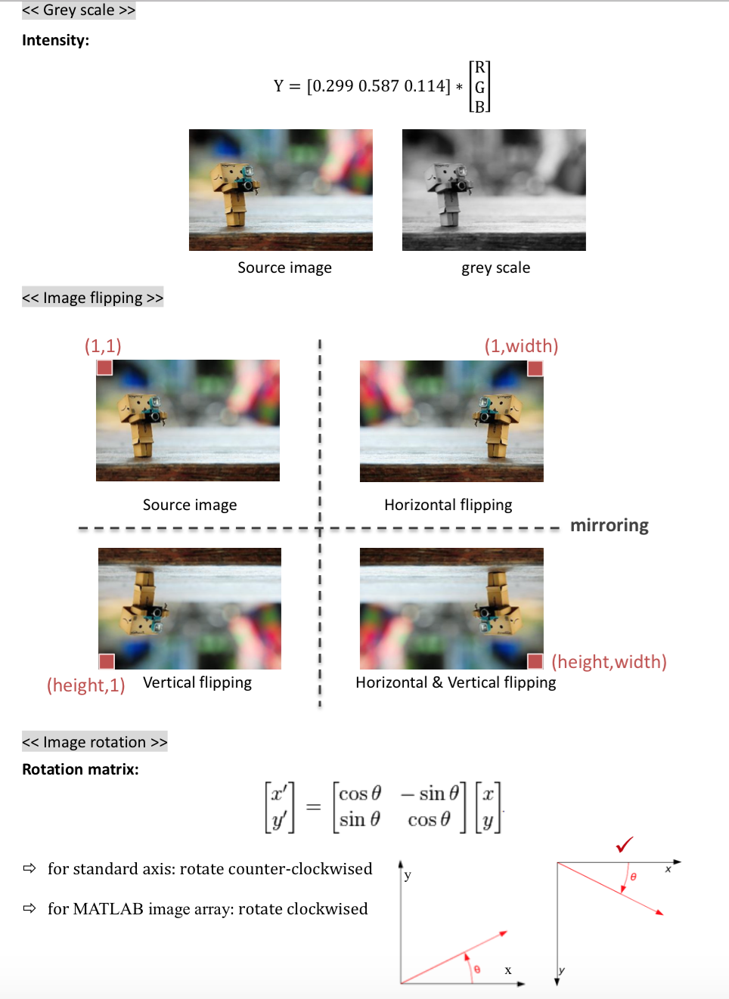
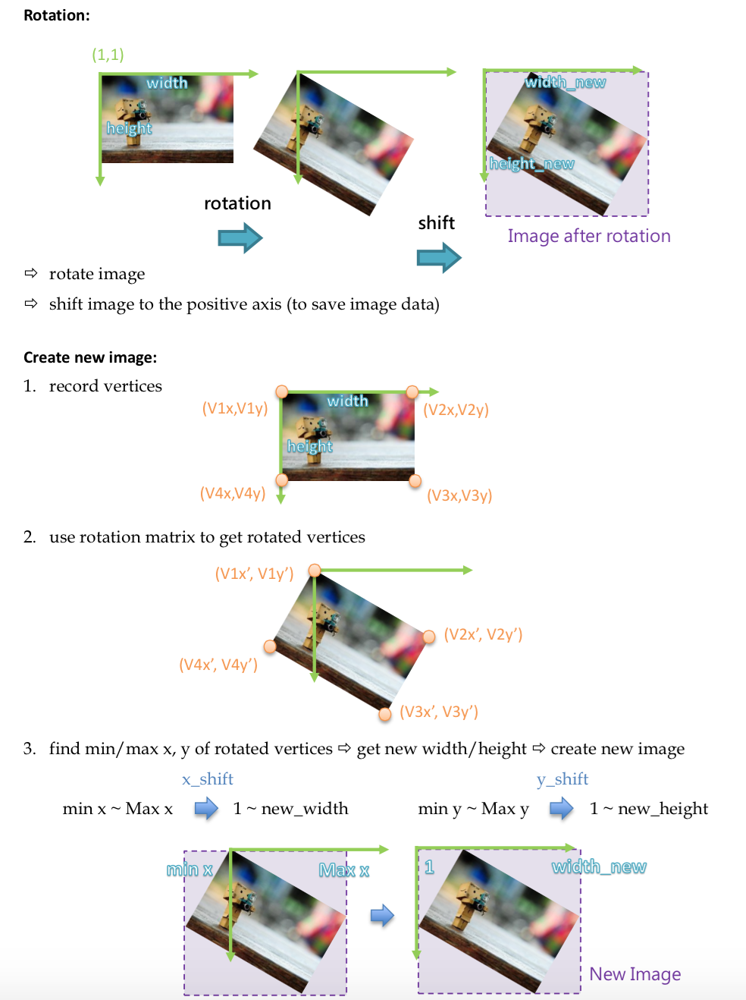
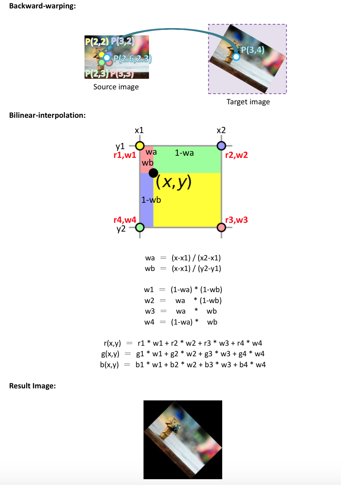
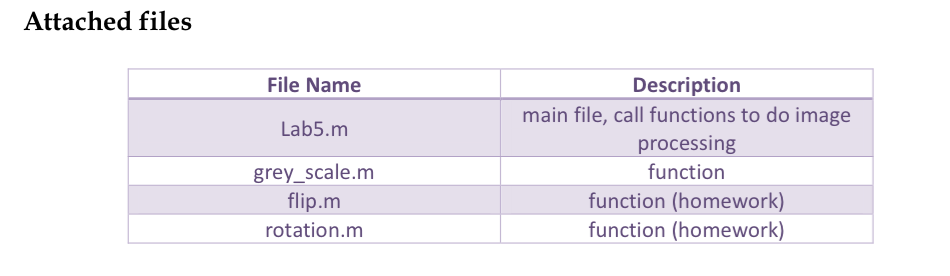

# HW0: Pixel array manipulation
## Brief
* Due: 10/24 at 8am
* Required files: results/index.md, and code/

# Objective
* Image file input/output.
* Pixel array manipulation, ex: image flip, rotation, grey scale.

# Prerequisite
* Matlab

# Pre-labs
* Read image and show it on the screen、save as a new image.
* Using grey_scale() function to obtain intensity image.

# Tutorials
```
<< Image Array of Matlab >>

Each image include 3 channel: R,G,B. Size of each channel is height x width.
I = imread(filename);       => [rrr...; ggg...; bbb...] 3 dimension matrix
R = I(:,:,1);               => [rrr...] 2 dimension matrix
G = I(:,:,2);               => [ggg...]
B = I(:,:,3);               => [bbb...]
r = R(h,w);                 => r 1 pixel 
g = G(h,w);                 => g
b = B(h,w);                 => b

******** Tips ********
1.	R = I(1:height, 1:width, 1);  => 1:height = 1~height
2.	R = I(:, :, 1);                 =>” : “ = all = 1~height
3.	" a=3 " vs " a=3; "            =>without " ; " to show the result on commend window
4.	" ctrl+Enter " to run code between ” %% “
5.	" ctrl+c " to stop “ run ”
6.	using " Breakpoints " to help you debug

```

<center>

<br>

<br>

<br>

<br>
(Left: originla image. Right: image overlap with corners.)
</center>

# Experiments
* Complete flip.m (30%) and rotation.m code (30%).

## Extra Points
* +2 pts: If you make your code publicly available.
* +2 pts: If you comment on pull request from students who fork the homework. <del>Make sure you send me a screenshot of the comments to me.</del> We can follow your discussion ourselves.
* Other things that impress me.

## Writeup
For this project, and all other projects, you must do a project report in results folder using [Markdown](https://help.github.com/articles/markdown-basics). We provide you with a placeholder [index.md](./results/index.md) document which you can edit. In the report you will describe your algorithm and any decisions you made to write your algorithm a particular way. Then, you will describe how to run your code and if your code depended on other packages. Finally, you will show and discuss the results of your algorithm. In the case of this project, show the results of your filtering algorithm (the test script saves such images already) and show some of the intermediate images in the hybrid image pipeline (e.g. the low and high frequency images, which the starter code already saves for you). Also, discuss anything extra you did. Feel free to add any other information you feel is relevant.

## Rubric
* +30 pts: Working implementation of flip.m
* +30 pts: Working implementation of rotation.m
* +40 pts: Writeup with several examples of image images. Each result shall include two images. One image is given by TA, and the other one is your own image.
* +5 pts: Extra credit (up to ten points)
* -5*n pts: Lose 5 points for every time (after the first) you do not follow the instructions for the hand in format

# Noted
* Some Matlab functions are not allowed to use , e.g. rgb2gray().
* Code with ”%%%” is where you need to write by yourself.

## Credits
	Assignment modified by Min Sun based on Prof. Huang's lab0 in 2014 


