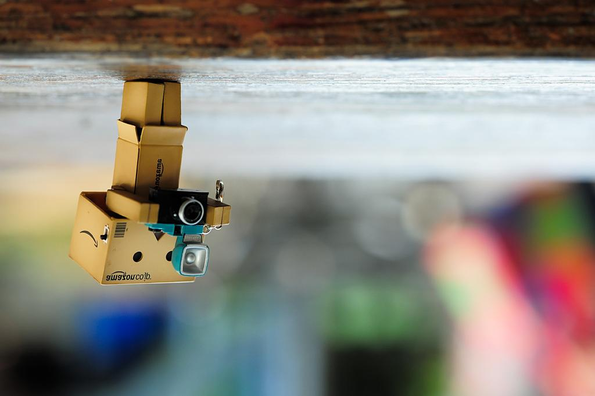
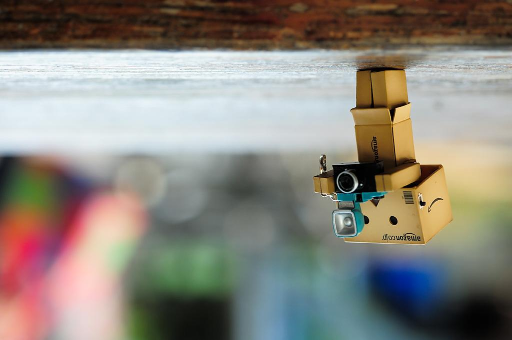
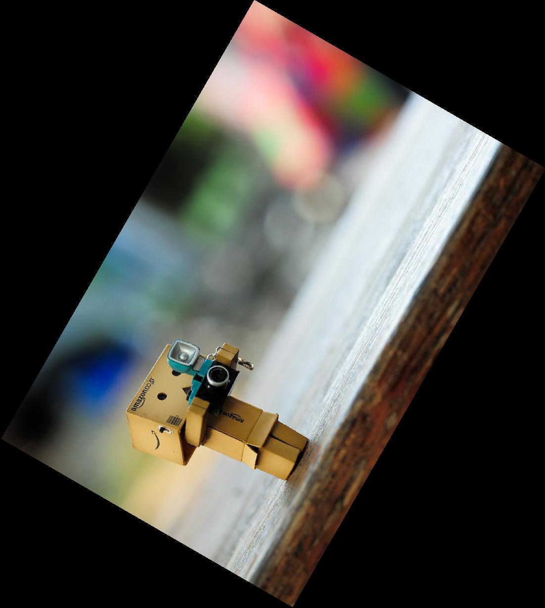

# Ching-Yao Chuang 102061145

# HW0 / Pixel array manipulation
## Overview
The project is related to 
> Simple image operations.


## Implementation
1. **flip.m**
	* Simply use a for-loop to to image flipping.
	
		```matlab
		for h = 1 : height
         for w = 1 : width 
            R_flip(h, w) = R(h, width - w + 1);
            G_flip(h, w) = G(h, width - w + 1);
            B_flip(h, w) = B(h, width - w + 1);
         end
       end
		```

2. **rotation.m**
	* Edge Estimation: Use rotaion matrix to estimate new coordinate, setting edges for new image.

	  ```matlab
	  matrix = [cos(radius) -sin(radius) ; sin(radius) cos(radius)];
     vertex = [1 1; width 1; 1 height; width height];
     vertex_new = (vertex * matrix)';	
	  ```
	  
	* Back-warping using Bilinear Interpolation: for each pixel on the rotation image, find the correspond r,g,b value. To acquire original position, we construct a reverse matrix to inverse the coordinate. Here's my pseudo code.

	  ```matlab
	  for each pixel
	      find sorce coordinate
	      Bilinear Interpolation
	      Assign RGB Value
	  end
	  ``` 

	

## Installation
* Simply run the matlab file.

### Results

<table border=1>
<tr>
<td>




</td>
</tr>

<tr>
<td>


</td>
</tr>

</table>


