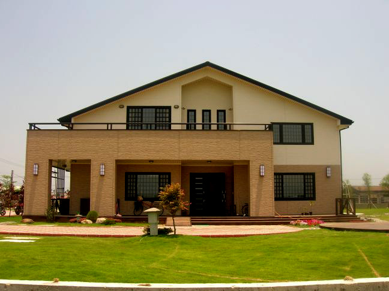
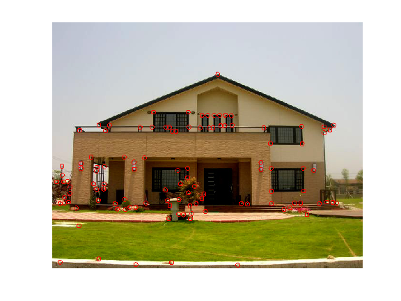

 
(Left: originla image. Right: image overlap with corners.)

# Project 2: Image Filtering and Corner Detection

## Brief
* Due: 11/07/2015 at 8am
* Required files: many original images and their overlaid corners, and MyHarrisCornerDetector.m

##Overview
The goal of this homework is to use image filter to calculate image gradients.
Then, we combine image gradients and apply Gaussian filter to compute second moment matrix at each pixel location.
Next, we can compute the corner response function described in our lecture note.
Finally, we apply a threshold and non-maximum suppression to obtain distinctive corner locations.

## Extra Points
* +2 pts: If you make your code publicly available.
* +2 pts: If you comment on pull request from students who fork the homework. <del>Make sure you send me a screenshot of the comments to me.</del> We can follow your discussion ourselves.
* +5 pts: If demo in class the calculation of Ixy
* Other things that impress me.

## Writeup
For this project, and all other projects, you must do a project report in results folder using [Markdown](https://help.github.com/articles/markdown-basics). We provide you with a placeholder [index.md](./results/index.md) document which you can edit. In the report you will describe your algorithm and any decisions you made to write your algorithm a particular way. Then, you will describe how to run your code and if your code depended on other packages. Finally, you will show and discuss the results of your algorithm. In the case of this project, show the results of your filtering algorithm (the test script saves such images already) and show some of the intermediate images in the hybrid image pipeline (e.g. the low and high frequency images, which the starter code already saves for you). Also, discuss anything extra you did. Feel free to add any other information you feel is relevant.

## Rubric
* +50 pts: Working implementation of corner detector in MyHarrisCornerDetector.m
* +30 pts: Working corner image generation
* +20 pts: Writeup with several examples of image images
* +5 pts: Extra credit (up to ten points)
* -5*n pts: Lose 5 points for every time (after the first) you do not follow the instructions for the hand in format

## Get start & hand in
* Publicly fork version (+2 extra points)
	- [Fork the homework](https://education.github.com/guide/forks) to obtain a copy of the homework in your github account
	- [Clone the homework](http://gitref.org/creating/#clone) to your local space and work on the code locally
	- Commit and push your local code to your github repo
	- Once you are done, submit your homework by [creating a pull request](https://help.github.com/articles/creating-a-pull-request)

* [Privately duplicated version](https://help.github.com/articles/duplicating-a-repository)
  - Make a bare clone
  - mirror-push to new repo
  - [make new repo private](https://help.github.com/articles/making-a-private-repository-public)
  - [add aliensunmin as collaborator](https://help.github.com/articles/adding-collaborators-to-a-personal-repository)
  - [Clone the homework](http://gitref.org/creating/#clone) to your local space and work on the code locally
  - Commit and push your local code to your github repo
  - I will clone your repo after the due date

## Credits
	Assignment modified by Min Sun and James Chan based on A. Ganoun's open source example.
