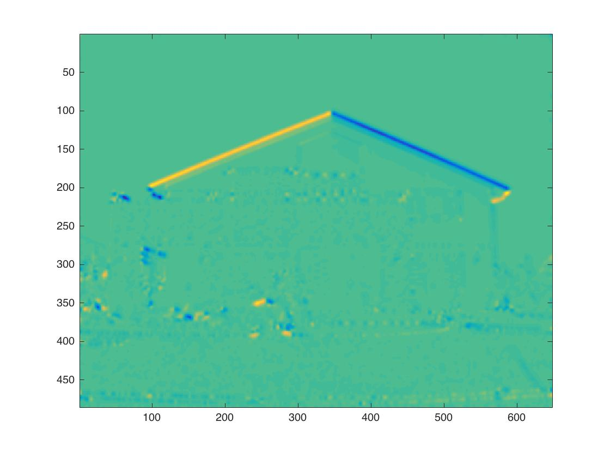
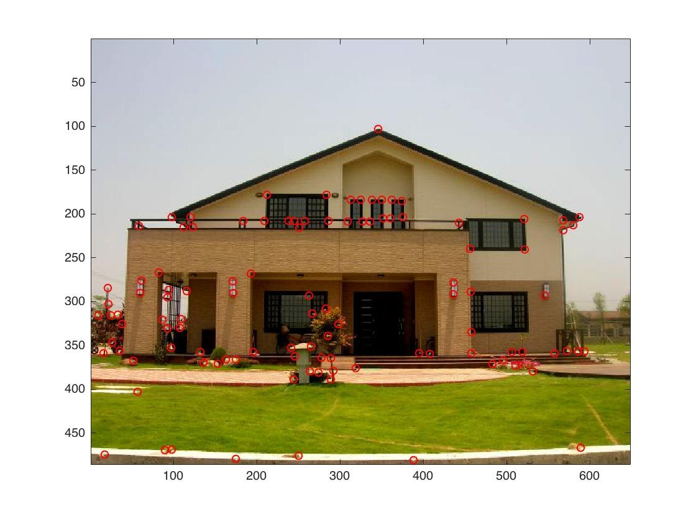
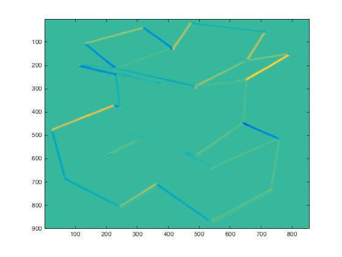
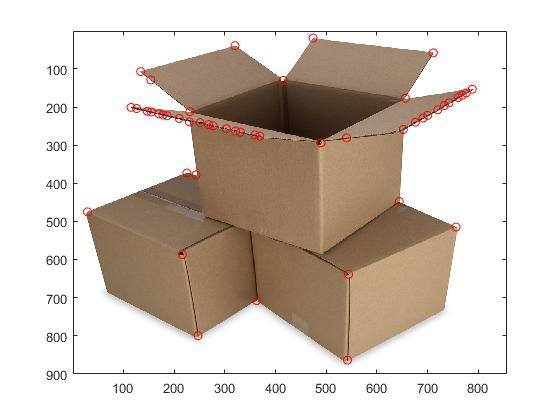
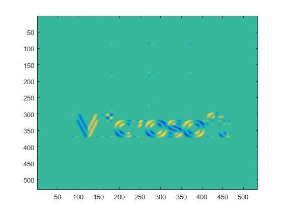
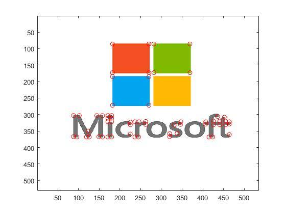

# Ching-Yao Chuang 102061145

# Project 2 / Corner Detection

## Overview
The project is related to image filtering and corner detection.
> quote


## Implementation
We simply follow TA's slides to implement.    

**1. Preperation**        
Converting RGB image to grey scale and change its type.

```matlab
frame = imread('data/Im.jpg');   
frame = rgb2gray(frame);   
I = double(frame);   
```

**2. Gradient Fiilter**    
We apply gradient filter on grey image to acquire Harris matrix. One thing worthed to mentioned is that I use matrix operation instead of for-loop to speed up the codes.

```matlab
x_gradient = imfilter(I, dx, 'same');
Ix = imfilter(x_gradient, g, 'same');
y_gradient = imfilter(I, dy, 'same');
Iy = imfilter(y_gradient, g, 'same');

Ix2 = (Ix - mean(mean(Ix))) .^2;
Iy2 = (Iy - mean(mean(Iy))) .^2;
Ixy = (Ix - mean(mean(Ix))) .* (Iy - mean(mean(Iy)));

Ix2 = imfilter(Ix2, g, 'same');
Iy2 = imfilter(Iy2, g, 'same');
Ixy = imfilter(Ixy, g, 'same');
```
**3. Corner Response**   
We follow the formula: R=dat(A)-alpha*(trace(A)^2) to calculate corner response where A is Harris matrix.

```matlab
M = zeros(2,2);
R = zeros(size(frame));
for i=1:xmax
  for j=1:ymax
    M = [Ix2(i,j) Ixy(i,j); Ixy(i,j) Iy2(i,j)];
    R(i,j) = det(M) - alpha * (trace(M)^2);
  end
end
```

**4. Threshould**
Here we use function "ordfilt2()" to find the real corner by comparing to the threshould we set. Ther we get RBinary by simple logic operation.

```matlab
sze = 2*r+1; % domain width 
MX = ordfilt2(R ,sze^2, ones(sze));
RBinary = (R==MX)&(R>Thrshold);
```


## Installation
* Simply run ```MyHarrisCornerDetector.m``` with Matlab.

### Results

<table border=1>

<tr>
<td align="center">
<b> Original Image</b>
</td>
<td align="center">
<b> Ixy<b/>
</td>
<td align="center">
<b> Corner Detection<b/>
</td>
</tr>

<tr>
<td>

</td>
<td>

</td>
<td>

</td>
</tr>

<tr>
<td>

</td>
<td>

</td>
<td>

</td>
</tr>

<tr>
<td>

</td>
<td>

</td>
<td>

</td>
</tr>


</table>

