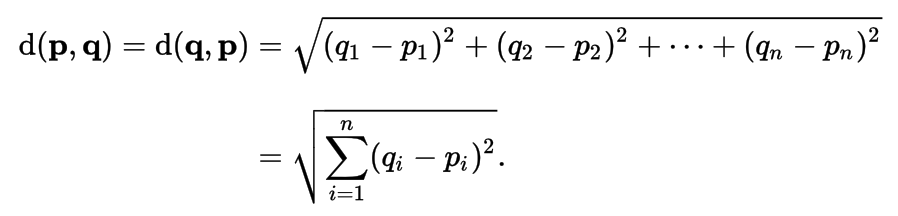
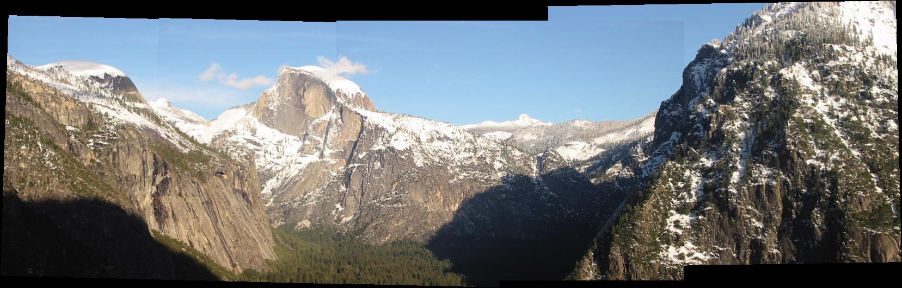
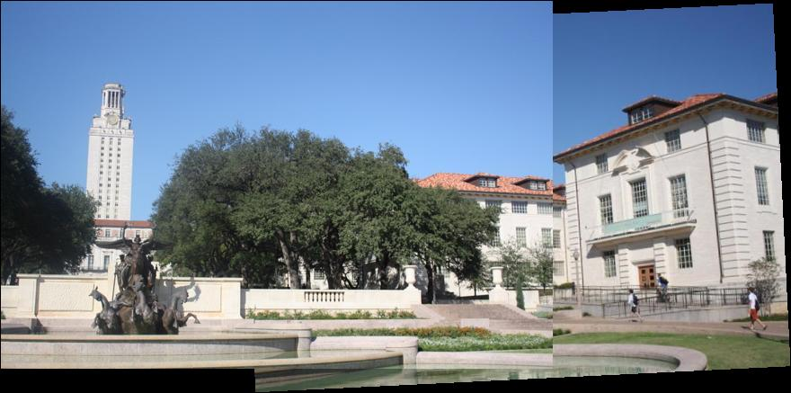
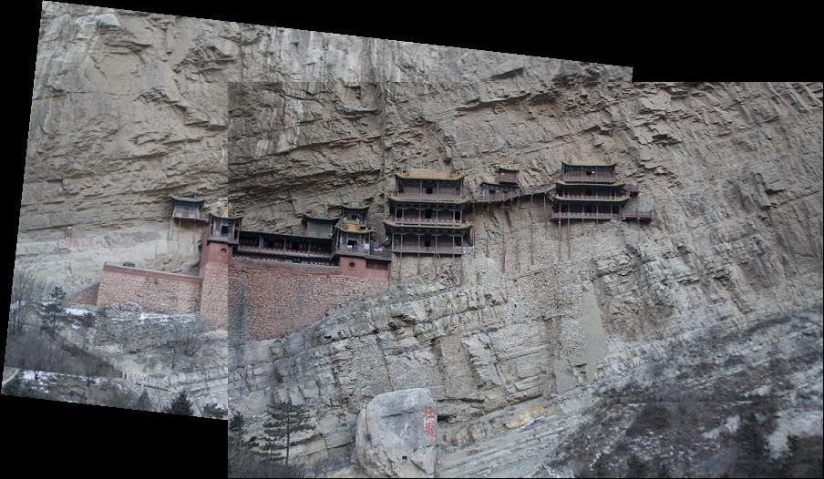
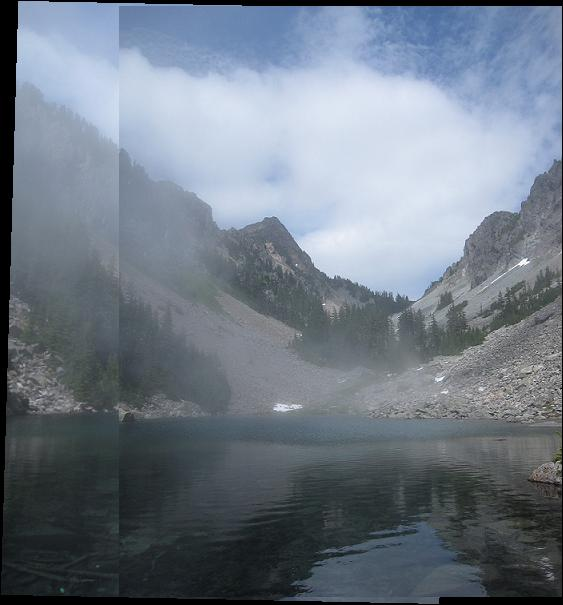

# Ching-Yao Chuang 102061145

# Project 2 / Panorama Stitching

## Overview
The project is related to 
> Automatic Panoramic Image Stitching using Invariant Features, Matthew Brown and David G.


## Implementation
###1. Matching SIFT Descriptors
Here we calculate the Euclidean distance between a given SIFT descriptor from image 1 and all SIFT descriptors from image 2. We simply follow the formula to calculate it.



In order to speed up, we replicate the tensor, using matrix operation to reduce complecity.       

```matlab
for i = 1 : N1 
    descriptor1_tile = repmat(descriptor1(i,:), N2, 1);   
    d = sqrt(sum((descriptor1_tile - descriptor2).^2, 2));    % Euclidean distance
```  

Then we sort the result to find the smallest distance and check the threshould.    

```matlab    
    [sort_d, idx] = sort(d);                 % sorting
    if sort_d(1) < (sort_d(2) * thresh)     % threshould checking
        match = [ match ; [i, idx(1)] ]; 
    end    
end

```

###2. Fitting the Transformation Matrix
We will use list of matched keypoints across the two images to find a transformation matrix H that maps an image 1 point to the corresponding coordinates in image 2. Codes here are quite simple, using MATLAB's "A\b" syntax to solve for H_transpose and find final H.

```matlab
H = (P1'\P2')';
```

###3. RANSAC
Here we apply RANSAC (“RANdom SAmple Consensus”) to select only “inliers” to use to compute the transformation matrix. Most of the procedure are implemented, so the only thing we need to do is finding their distance.

```matab
[M col] = size(match);
p1 = [pt1(match(:, 1),:), ones(M,1)]*H';
p2 = [pt2(match(:, 2),:), ones(M,1)];
dists = sqrt(sum((p2 - p1).^2, 2));
```

###4. Stitching Multiple Images
Finally we are going to stitch multiple images **with order**. Like the previous step, most of the codes are already implemented, the effor we done is comlete function ```makeTransformToReferenceFrame()```. We calcualte homogeneous matrix to convert a point in the current frame into the corresponding point in the reference frame.

```matlab
T = eye(3);
if currentFrameIndex < refFrameIndex
    for i = currentFrameIndex : (refFrameIndex - 1)
        T = i_To_iPlusOne_Transform{i} * T; 
    end
elseif currentFrameIndex > refFrameIndex
    for i = refFrameIndex : (currentFrameIndex - 1)
        T = pinv(i_To_iPlusOne_Transform{i}) * T;
    end
end
```


## Installation
* Follow the [website](http://www.vlfeat.org/install-matlab.html) to setup VLFeat in MATLAB. 
* Simply run the code.

### Results

<table border=1>
<tr>
<td>

</td>
</tr>

<tr>
<td>

</td>
</tr>

<tr>
<td>

</td>
</tr>

<tr>
<td>

</td>
</tr>

<tr>
<td>

</td>
</tr>

</table>
