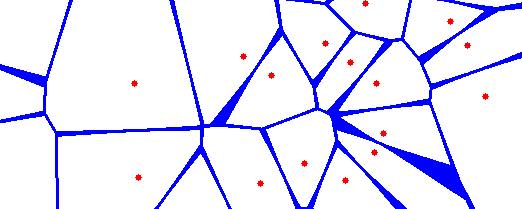
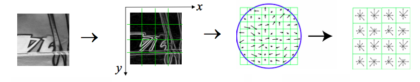
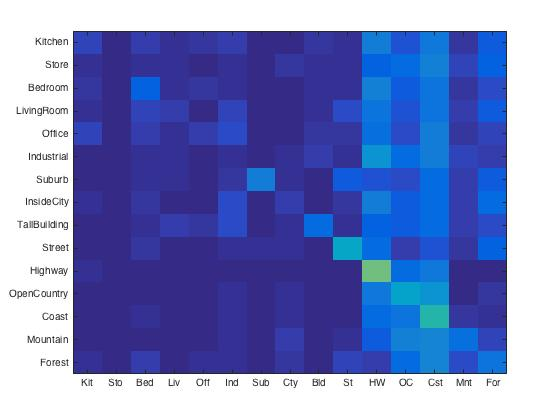
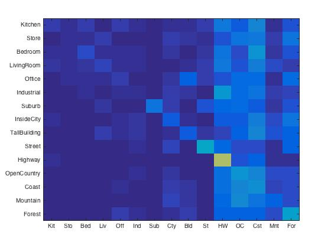
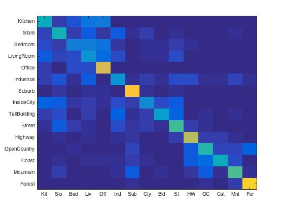
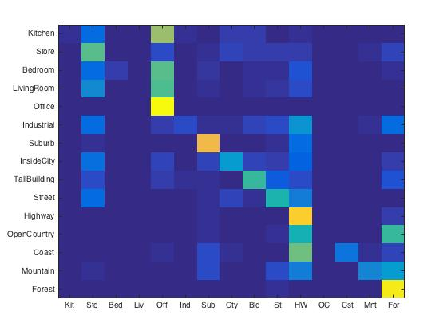
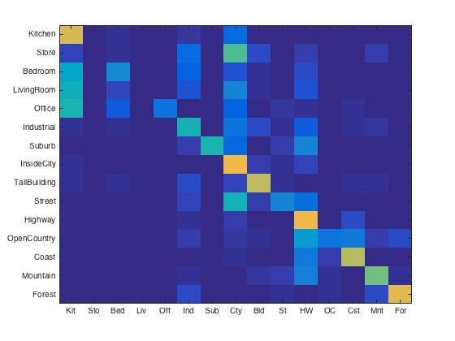
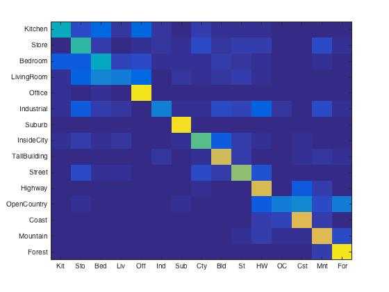
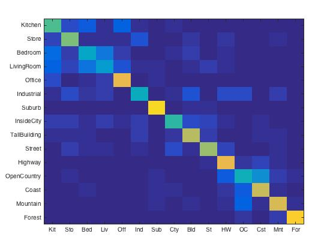

# Ching-Yao Chuang 102061145

# Project 3 / Scene recognition with bag of words

## Overview
The project is related to 
> tiny image, nearest neighbor classifier, bags of SIFT features, 1-vs-all linear SVMS

## Implementation
###1. Tiny Image Representation
The "tiny image" feature is one of the simplest possible image representations. The only thing we need to do is simply resizing each image to a small, fixed resolution (16x16). 

In ```get_tiny_images.m```, I directly use ```imresize()``` and ```reshape()``` to aquire a 256D feature.

```python
image = imresize(imread(image_paths{i, 1}), [16 16]);
image_feat = reshape(image, [256, 1]);
```

Normalize the image feature will slightly increase the performance.

```python
image_feat = image_feat ./ sum(image_feat);   
image_feat = image_feat - mean(image_feat);    
```

###2. Nearest Neighbor Classifier
In NN Classifier, we simply finds the "nearest" training example and assigns the test case the label of that nearest training example.



In ```nearest_neighbor_classify.m``` we use ```vlfeat-0.9.20``` library to help us perform some complex steps.

```python
dist = vl_alldist2(train_image_feats', test_image_feats');
```

Here we predict category by finding the "nearest" training example.

```python
[junk, idx] = min(dist(i, :));
label = train_labels(idx, 1);
```

###3. Bags of SIFT
Here we are going to try another feature representation called bag of "visual" words. Visual words are ‘iconic’ image patches or fragments representing the frequency of word occurrence but not their position. In this project we use SIFT as our descriptors which indicate the distribution of the gradient over an image patch.



First, we establish a vocabulary of visual words by sampling many local features from our training set and then clustering them with kmeans (in ```build_volcabulary.m```).

Before clustering, we turn the image to gray scale.

```python
if size(image, 3) > 1
    image =rgb2gray(image);
end
```

Then use the library to acquire SIFT feature.
```python
[locat, SIFT_feat] = vl_dsift(image, 'step', 15, 'fast');
```

Now we can represent our training and testing images as histograms of visual words. For each image we will densely sample many SIFT descriptors. Instead of storing hundreds of SIFT descriptors, we simply count how many SIFT descriptors fall into each cluster in our visual word vocabulary. Here's the key part of code (skip rgb2gray & normalization).

```python
[locations, SIFT_feat] = vl_dsift(image, 'step', 3, 'fast');
[idx , dist] = vl_kdtreequery(forest , vocab' , double(SIFT_feat));
```

This part will take A LOT OF TIME. So I highly recommend that one can save the feature after running the function once.

```python
if split == 'train'
    save('train_feat.mat', 'image_feats');
else
    save('test_feat.mat', 'image_feats');
end
```

###4. 1-vs-all Linear SVMS
We train 1-vs-all linear SVMS to operate in the bag of SIFT feature space. Linear classifiers are one of the simplest possible learning models. The feature space is partitioned by a learned hyperplane and test cases are categorized based on which side of that hyperplane they fall on.


First we create binary labels for SVM training by using ```strcmp()```.

```python
matching_indices = strcmp(categories(i) , train_labels);
matching_indices = double(matching_indices);
for j = 1: size(train_labels, 1)
    if(matching_indices(j) == 0)
        matching_indices(j) = -1;
    end
end
```

Then we use the library to train a SVM classifier.

```python
[w, b] = vl_svmtrain(train_image_feats', matching_indices, lambda);
```

Note that we need to repeat the procedure above for each individual category.


## Installation
* Follow the [website](http://www.vlfeat.org/install-matlab.html) to setup VLFeat in MATLAB. 
* Simply run the code.

## Experiment Result

### Accuracy
<table border=0 cellpadding=4 cellspacing=1>
<tr>
<th>Method</th>
<th>Accuracy</th>
<th>Confusion Matrix</th>
</tr>
<tr>
<td>Random Guess</td>
<td>5.2%</td>
<td></td>
</tr>
<td>Tiny Image + Nearest Neighbor (without normalize)</td>
<td>19.1%</td>
<td></td>
</tr>
</tr>
<td>Tiny Image + Nearest Neighbor (with normalize)</td>
<td>19.9%</td>
<td></td>
</tr>
</tr>
<td>Bag of SIFT + Nearest Neigbor</td>
<td>49.8%</td>
<td></td>
</tr>
</tr>
<td>Bag of SIFT + SVM (Lambda = 0.1)</td>
<td>40.6%</td>
<td></td>
</tr>
</tr>
<td>Bag of SIFT + SVM (Lambda = 0.01)</td>
<td>46.3%</td>
<td></td>
</tr>
</tr>
<td>Bag of SIFT + SVM (Lambda = 0.001)</td>
<td>61.3%</td>
<td></td>
</tr>
</tr>
<td>Bag of SIFT + SVM (Lambda = 0.0001)</td>
<td>65.3%</td>
<td></td>
</tr>
</tr>
<td>Bag of SIFT + SVM (Lambda = 0.00001)</td>
<td>62.7%</td>
<td></td>
</tr>


<table border=0 cellpadding=4 cellspacing=1>
<tr>
<th>Category name</th>
<th>Accuracy</th>
<th colspan=2>Sample training images</th>
<th colspan=2>Sample true positives</th>
<th colspan=2>False positives with true label</th>
<th colspan=2>False negatives with wrong predicted label</th>
</tr>
<tr>
<td>Kitchen</td>
<td>0.520</td>
<td bgcolor=LightBlue></td>
<td bgcolor=LightBlue></td>
<td bgcolor=LightGreen></td>
<td bgcolor=LightGreen></td>
<td bgcolor=LightCoral><br><small>InsideCity</small></td>
<td bgcolor=LightCoral><br><small>LivingRoom</small></td>
<td bgcolor=#FFBB55><br><small>Bedroom</small></td>
<td bgcolor=#FFBB55><br><small>Office</small></td>
</tr>
<tr>
<td>Store</td>
<td>0.540</td>
<td bgcolor=LightBlue></td>
<td bgcolor=LightBlue></td>
<td bgcolor=LightGreen></td>
<td bgcolor=LightGreen></td>
<td bgcolor=LightCoral><br><small>Industrial</small></td>
<td bgcolor=LightCoral><br><small>Industrial</small></td>
<td bgcolor=#FFBB55><br><small>Highway</small></td>
<td bgcolor=#FFBB55><br><small>TallBuilding</small></td>
</tr>
<tr>
<td>Bedroom</td>
<td>0.360</td>
<td bgcolor=LightBlue></td>
<td bgcolor=LightBlue></td>
<td bgcolor=LightGreen></td>
<td bgcolor=LightGreen></td>
<td bgcolor=LightCoral><br><small>LivingRoom</small></td>
<td bgcolor=LightCoral><br><small>Kitchen</small></td>
<td bgcolor=#FFBB55><br><small>Store</small></td>
<td bgcolor=#FFBB55><br><small>LivingRoom</small></td>
</tr>
<tr>
<td>LivingRoom</td>
<td>0.350</td>
<td bgcolor=LightBlue></td>
<td bgcolor=LightBlue></td>
<td bgcolor=LightGreen></td>
<td bgcolor=LightGreen></td>
<td bgcolor=LightCoral><br><small>Bedroom</small></td>
<td bgcolor=LightCoral><br><small>Bedroom</small></td>
<td bgcolor=#FFBB55><br><small>Bedroom</small></td>
<td bgcolor=#FFBB55><br><small>Kitchen</small></td>
</tr>
<tr>
<td>Office</td>
<td>0.860</td>
<td bgcolor=LightBlue></td>
<td bgcolor=LightBlue></td>
<td bgcolor=LightGreen></td>
<td bgcolor=LightGreen></td>
<td bgcolor=LightCoral><br><small>Bedroom</small></td>
<td bgcolor=LightCoral><br><small>Bedroom</small></td>
<td bgcolor=#FFBB55><br><small>Kitchen</small></td>
<td bgcolor=#FFBB55><br><small>Kitchen</small></td>
</tr>
<tr>
<td>Industrial</td>
<td>0.500</td>
<td bgcolor=LightBlue></td>
<td bgcolor=LightBlue></td>
<td bgcolor=LightGreen></td>
<td bgcolor=LightGreen></td>
<td bgcolor=LightCoral><br><small>Store</small></td>
<td bgcolor=LightCoral><br><small>InsideCity</small></td>
<td bgcolor=#FFBB55><br><small>TallBuilding</small></td>
<td bgcolor=#FFBB55><br><small>Bedroom</small></td>
</tr>
<tr>
<td>Suburb</td>
<td>0.950</td>
<td bgcolor=LightBlue></td>
<td bgcolor=LightBlue></td>
<td bgcolor=LightGreen></td>
<td bgcolor=LightGreen></td>
<td bgcolor=LightCoral><br><small>InsideCity</small></td>
<td bgcolor=LightCoral><br><small>Industrial</small></td>
<td bgcolor=#FFBB55><br><small>Coast</small></td>
<td bgcolor=#FFBB55><br><small>Mountain</small></td>
</tr>
<tr>
<td>InsideCity</td>
<td>0.490</td>
<td bgcolor=LightBlue></td>
<td bgcolor=LightBlue></td>
<td bgcolor=LightGreen></td>
<td bgcolor=LightGreen></td>
<td bgcolor=LightCoral><br><small>Street</small></td>
<td bgcolor=LightCoral><br><small>Street</small></td>
<td bgcolor=#FFBB55><br><small>Store</small></td>
<td bgcolor=#FFBB55><br><small>LivingRoom</small></td>
</tr>
<tr>
<td>TallBuilding</td>
<td>0.760</td>
<td bgcolor=LightBlue></td>
<td bgcolor=LightBlue></td>
<td bgcolor=LightGreen></td>
<td bgcolor=LightGreen></td>
<td bgcolor=LightCoral><br><small>Industrial</small></td>
<td bgcolor=LightCoral><br><small>Store</small></td>
<td bgcolor=#FFBB55><br><small>Mountain</small></td>
<td bgcolor=#FFBB55><br><small>Store</small></td>
</tr>
<tr>
<td>Street</td>
<td>0.700</td>
<td bgcolor=LightBlue></td>
<td bgcolor=LightBlue></td>
<td bgcolor=LightGreen></td>
<td bgcolor=LightGreen></td>
<td bgcolor=LightCoral><br><small>Industrial</small></td>
<td bgcolor=LightCoral><br><small>InsideCity</small></td>
<td bgcolor=#FFBB55><br><small>InsideCity</small></td>
<td bgcolor=#FFBB55><br><small>Highway</small></td>
</tr>
<tr>
<td>Highway</td>
<td>0.790</td>
<td bgcolor=LightBlue></td>
<td bgcolor=LightBlue></td>
<td bgcolor=LightGreen></td>
<td bgcolor=LightGreen></td>
<td bgcolor=LightCoral><br><small>Mountain</small></td>
<td bgcolor=LightCoral><br><small>LivingRoom</small></td>
<td bgcolor=#FFBB55><br><small>Industrial</small></td>
<td bgcolor=#FFBB55><br><small>Coast</small></td>
</tr>
<tr>
<td>OpenCountry</td>
<td>0.440</td>
<td bgcolor=LightBlue></td>
<td bgcolor=LightBlue></td>
<td bgcolor=LightGreen></td>
<td bgcolor=LightGreen></td>
<td bgcolor=LightCoral><br><small>Suburb</small></td>
<td bgcolor=LightCoral><br><small>Mountain</small></td>
<td bgcolor=#FFBB55><br><small>Forest</small></td>
<td bgcolor=#FFBB55><br><small>Suburb</small></td>
</tr>
<tr>
<td>Coast</td>
<td>0.770</td>
<td bgcolor=LightBlue></td>
<td bgcolor=LightBlue></td>
<td bgcolor=LightGreen></td>
<td bgcolor=LightGreen></td>
<td bgcolor=LightCoral><br><small>Highway</small></td>
<td bgcolor=LightCoral><br><small>Mountain</small></td>
<td bgcolor=#FFBB55><br><small>Mountain</small></td>
<td bgcolor=#FFBB55><br><small>Suburb</small></td>
</tr>
<tr>
<td>Mountain</td>
<td>0.830</td>
<td bgcolor=LightBlue></td>
<td bgcolor=LightBlue></td>
<td bgcolor=LightGreen></td>
<td bgcolor=LightGreen></td>
<td bgcolor=LightCoral><br><small>Industrial</small></td>
<td bgcolor=LightCoral><br><small>Coast</small></td>
<td bgcolor=#FFBB55><br><small>OpenCountry</small></td>
<td bgcolor=#FFBB55><br><small>OpenCountry</small></td>
</tr>
<tr>
<td>Forest</td>
<td>0.940</td>
<td bgcolor=LightBlue></td>
<td bgcolor=LightBlue></td>
<td bgcolor=LightGreen></td>
<td bgcolor=LightGreen></td>
<td bgcolor=LightCoral><br><small>OpenCountry</small></td>
<td bgcolor=LightCoral><br><small>Store</small></td>
<td bgcolor=#FFBB55><br><small>Mountain</small></td>
<td bgcolor=#FFBB55><br><small>Mountain</small></td>
</tr>
<tr>
<th>Category name</th>
<th>Accuracy</th>
<th colspan=2>Sample training images</th>
<th colspan=2>Sample true positives</th>
<th colspan=2>False positives with true label</th>
<th colspan=2>False negatives with wrong predicted label</th>
</tr>
</table>
</center>


