

<h1>Project 3 results visualization</h1>
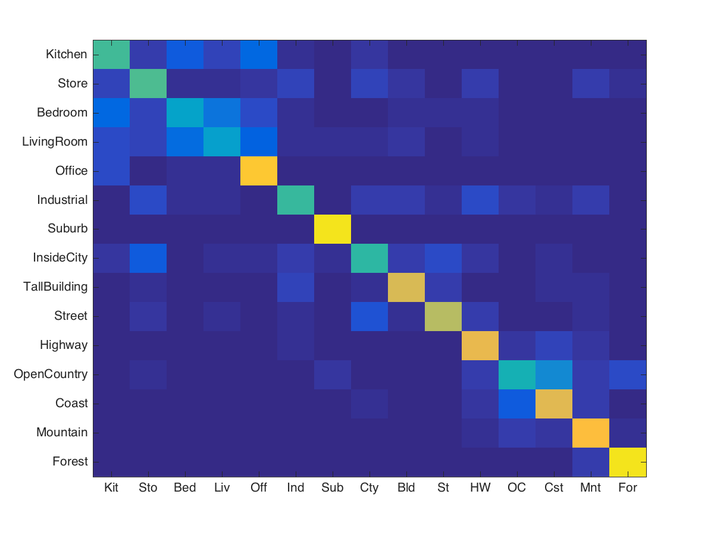

 
Accuracy (mean of diagonal of confusion matrix) is 0.653

<table border=0 cellpadding=4 cellspacing=1>
<tr>
<th>Category name</th>
<th>Accuracy</th>
<th colspan=2>Sample training images</th>
<th colspan=2>Sample true positives</th>
<th colspan=2>False positives with true label</th>
<th colspan=2>False negatives with wrong predicted label</th>
</tr>
<tr>
<td>Kitchen</td>
<td>0.520</td>
<td bgcolor=LightBlue></td>
<td bgcolor=LightBlue></td>
<td bgcolor=LightGreen>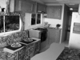</td>
<td bgcolor=LightGreen>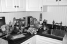</td>
<td bgcolor=LightCoral> <small>InsideCity</small></td>
<td bgcolor=LightCoral>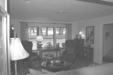 <small>LivingRoom</small></td>
<td bgcolor=#FFBB55>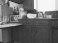 <small>Bedroom</small></td>
<td bgcolor=#FFBB55> <small>Office</small></td>
</tr>
<tr>
<td>Store</td>
<td>0.540</td>
<td bgcolor=LightBlue></td>
<td bgcolor=LightBlue>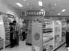</td>
<td bgcolor=LightGreen>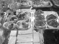</td>
<td bgcolor=LightGreen>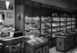</td>
<td bgcolor=LightCoral> <small>Industrial</small></td>
<td bgcolor=LightCoral> <small>Industrial</small></td>
<td bgcolor=#FFBB55> <small>Highway</small></td>
<td bgcolor=#FFBB55> <small>TallBuilding</small></td>
</tr>
<tr>
<td>Bedroom</td>
<td>0.360</td>
<td bgcolor=LightBlue>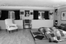</td>
<td bgcolor=LightBlue></td>
<td bgcolor=LightGreen></td>
<td bgcolor=LightGreen></td>
<td bgcolor=LightCoral>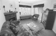 <small>LivingRoom</small></td>
<td bgcolor=LightCoral>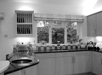 <small>Kitchen</small></td>
<td bgcolor=#FFBB55>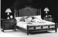 <small>Store</small></td>
<td bgcolor=#FFBB55>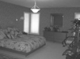 <small>LivingRoom</small></td>
</tr>
<tr>
<td>LivingRoom</td>
<td>0.350</td>
<td bgcolor=LightBlue>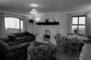</td>
<td bgcolor=LightBlue>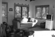</td>
<td bgcolor=LightGreen>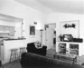</td>
<td bgcolor=LightGreen>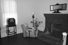</td>
<td bgcolor=LightCoral>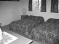 <small>Bedroom</small></td>
<td bgcolor=LightCoral>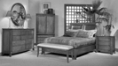 <small>Bedroom</small></td>
<td bgcolor=#FFBB55>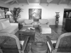 <small>Bedroom</small></td>
<td bgcolor=#FFBB55>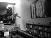 <small>Kitchen</small></td>
</tr>
<tr>
<td>Office</td>
<td>0.860</td>
<td bgcolor=LightBlue></td>
<td bgcolor=LightBlue></td>
<td bgcolor=LightGreen></td>
<td bgcolor=LightGreen></td>
<td bgcolor=LightCoral> <small>Bedroom</small></td>
<td bgcolor=LightCoral> <small>Bedroom</small></td>
<td bgcolor=#FFBB55> <small>Kitchen</small></td>
<td bgcolor=#FFBB55> <small>Kitchen</small></td>
</tr>
<tr>
<td>Industrial</td>
<td>0.500</td>
<td bgcolor=LightBlue></td>
<td bgcolor=LightBlue></td>
<td bgcolor=LightGreen></td>
<td bgcolor=LightGreen></td>
<td bgcolor=LightCoral>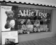 <small>Store</small></td>
<td bgcolor=LightCoral> <small>InsideCity</small></td>
<td bgcolor=#FFBB55> <small>TallBuilding</small></td>
<td bgcolor=#FFBB55> <small>Bedroom</small></td>
</tr>
<tr>
<td>Suburb</td>
<td>0.950</td>
<td bgcolor=LightBlue>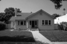</td>
<td bgcolor=LightBlue>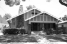</td>
<td bgcolor=LightGreen>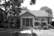</td>
<td bgcolor=LightGreen>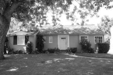</td>
<td bgcolor=LightCoral>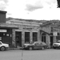 <small>InsideCity</small></td>
<td bgcolor=LightCoral>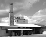 <small>Industrial</small></td>
<td bgcolor=#FFBB55>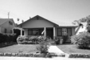 <small>Coast</small></td>
<td bgcolor=#FFBB55>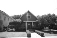 <small>Mountain</small></td>
</tr>
<tr>
<td>InsideCity</td>
<td>0.490</td>
<td bgcolor=LightBlue></td>
<td bgcolor=LightBlue></td>
<td bgcolor=LightGreen></td>
<td bgcolor=LightGreen></td>
<td bgcolor=LightCoral> <small>Street</small></td>
<td bgcolor=LightCoral> <small>Street</small></td>
<td bgcolor=#FFBB55> <small>Store</small></td>
<td bgcolor=#FFBB55> <small>LivingRoom</small></td>
</tr>
<tr>
<td>TallBuilding</td>
<td>0.760</td>
<td bgcolor=LightBlue></td>
<td bgcolor=LightBlue></td>
<td bgcolor=LightGreen></td>
<td bgcolor=LightGreen></td>
<td bgcolor=LightCoral> <small>Industrial</small></td>
<td bgcolor=LightCoral> <small>Store</small></td>
<td bgcolor=#FFBB55> <small>Mountain</small></td>
<td bgcolor=#FFBB55> <small>Store</small></td>
</tr>
<tr>
<td>Street</td>
<td>0.700</td>
<td bgcolor=LightBlue></td>
<td bgcolor=LightBlue></td>
<td bgcolor=LightGreen>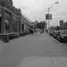</td>
<td bgcolor=LightGreen>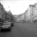</td>
<td bgcolor=LightCoral> <small>Industrial</small></td>
<td bgcolor=LightCoral> <small>InsideCity</small></td>
<td bgcolor=#FFBB55> <small>InsideCity</small></td>
<td bgcolor=#FFBB55>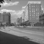 <small>Highway</small></td>
</tr>
<tr>
<td>Highway</td>
<td>0.790</td>
<td bgcolor=LightBlue></td>
<td bgcolor=LightBlue></td>
<td bgcolor=LightGreen></td>
<td bgcolor=LightGreen></td>
<td bgcolor=LightCoral> <small>Mountain</small></td>
<td bgcolor=LightCoral>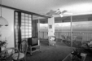 <small>LivingRoom</small></td>
<td bgcolor=#FFBB55> <small>Industrial</small></td>
<td bgcolor=#FFBB55> <small>Coast</small></td>
</tr>
<tr>
<td>OpenCountry</td>
<td>0.440</td>
<td bgcolor=LightBlue>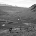</td>
<td bgcolor=LightBlue>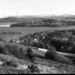</td>
<td bgcolor=LightGreen>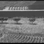</td>
<td bgcolor=LightGreen>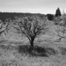</td>
<td bgcolor=LightCoral>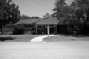 <small>Suburb</small></td>
<td bgcolor=LightCoral> <small>Mountain</small></td>
<td bgcolor=#FFBB55>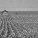 <small>Forest</small></td>
<td bgcolor=#FFBB55> <small>Suburb</small></td>
</tr>
<tr>
<td>Coast</td>
<td>0.770</td>
<td bgcolor=LightBlue></td>
<td bgcolor=LightBlue></td>
<td bgcolor=LightGreen></td>
<td bgcolor=LightGreen>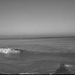</td>
<td bgcolor=LightCoral> <small>Highway</small></td>
<td bgcolor=LightCoral> <small>Mountain</small></td>
<td bgcolor=#FFBB55> <small>Mountain</small></td>
<td bgcolor=#FFBB55>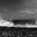 <small>Suburb</small></td>
</tr>
<tr>
<td>Mountain</td>
<td>0.830</td>
<td bgcolor=LightBlue></td>
<td bgcolor=LightBlue>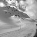</td>
<td bgcolor=LightGreen></td>
<td bgcolor=LightGreen>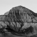</td>
<td bgcolor=LightCoral> <small>Industrial</small></td>
<td bgcolor=LightCoral> <small>Coast</small></td>
<td bgcolor=#FFBB55> <small>OpenCountry</small></td>
<td bgcolor=#FFBB55> <small>OpenCountry</small></td>
</tr>
<tr>
<td>Forest</td>
<td>0.940</td>
<td bgcolor=LightBlue></td>
<td bgcolor=LightBlue>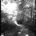</td>
<td bgcolor=LightGreen></td>
<td bgcolor=LightGreen></td>
<td bgcolor=LightCoral> <small>OpenCountry</small></td>
<td bgcolor=LightCoral>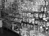 <small>Store</small></td>
<td bgcolor=#FFBB55> <small>Mountain</small></td>
<td bgcolor=#FFBB55> <small>Mountain</small></td>
</tr>
<tr>
<th>Category name</th>
<th>Accuracy</th>
<th colspan=2>Sample training images</th>
<th colspan=2>Sample true positives</th>
<th colspan=2>False positives with true label</th>
<th colspan=2>False negatives with wrong predicted label</th>
</tr>
</table>

