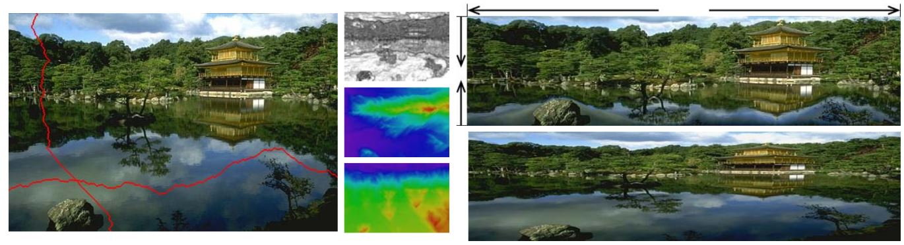
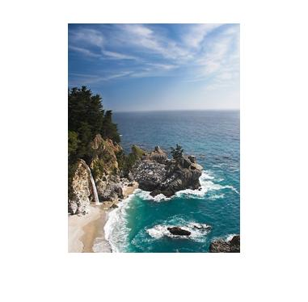
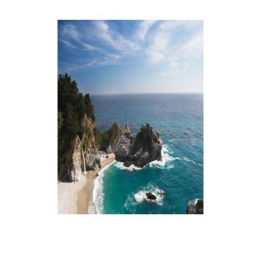
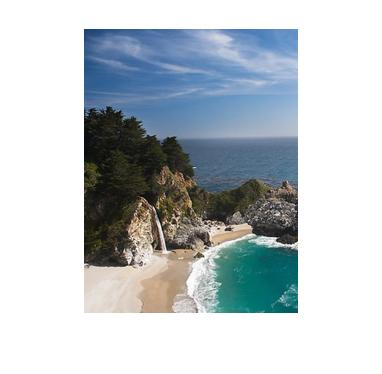
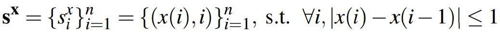
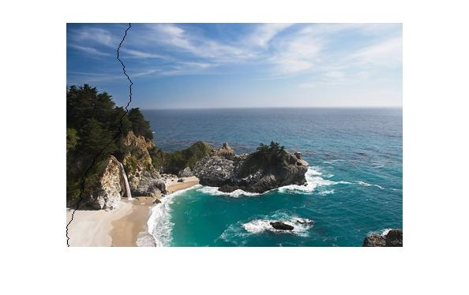
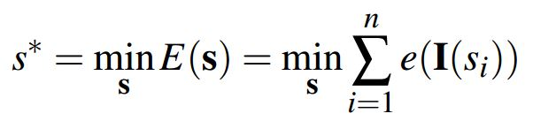

 

(On the left is the original image with one horizontal and one vertical
seam. The example on the top right shows the result of extending in one dimension and reducing in the other, compared to
standard scaling on the bottom right.)

# Project 3: Seam Carving for Content-Aware Image Resizing

## Brief
* Due: 11/14/2016 at 8am
* Required files: results/index.md, and code/

##Overview
Seam carving is an algorithm for content-aware image resizing, it was described in the [paper](http://www.win.tue.nl/~wstahw/edu/2IV05/seamcarving.pdf) by S. Avidan & A. Shamir. In contract to stretching, content-aware resizing allows to remove/add pixels which has less meaning while saving more important.

In this programming assignment, we will implement this algorithm and this will involve following tasks:

* Define an energy function that would map a pixel into energy value.
* Define the path of pixels (called seam), which length is width/height of the image.
* Looking for a seam with the minimum energy among all seams(in chosen dimension).
* Find optimal order of deleting seams.
* Reduce an image by a given mask.

<table border=0>
<tr>
<td>|-------------seam carving-------------|
</td>
<td>
|----------------scaling-----------------|
</td>
<td>
|--------------cropping----------------|
</td>
</table>
</tr>
<table border=1>
<tr>
<td>

</tr>
</table>
##Details
For simplification, we will describe only reducing the size of the image. Enlarging process is very similar and described in the last section, and this part is not required but you can implement it by yourself.
### Energy
The idea is to remove content that has smaller meaning for the user (contain less information). We will call this information “energy”. Thus we need to introduce an energy function that would map a pixel into energy value. Here we use gradient of the pixel as an energy function: `e=|dI/dx|+|dI/dy|`.
If the picture has 3 channels, just sum values of the energy for each channel. Edit `energyRGB.m` for doing this part.
### Seam
If we delete pixels with minimum energy but random positions, we will get distorted picture. If we delete columns/rows with minimum energy, we will get artifacts. The solution is to introduce a generalization of column/row (called seam). Formally, let I is n x m image, then a vertical seam is defined as follow: 

where x is a mapping x: [1,..,n] -> [1,..,m]. It means that a vertical seam is path from the top of the picture to the bottom such that the length of the path in pixels is width of the image, and for each seam element `(i,j)`, the next seam element can be only `(i+1, j-1)`, `(i+1, j)`, `(i+1, j+1)`. Similarly, we can define a horizontal seam. Examples of seams are shown on the figure below in black:

We are looking for a seam with the minimum energy among all seams (in chosen dimension): 

. 

The way to find such an optimal seam is by using dynamic programming:

1. Find `M` - minimum energy for all possible seams for each `(i, j)`:
 * fill in the first row by energy
 * for all rows starting from second: `M[i, j] = e[i, j] + min(M[i - 1, j - 1], M[i - 1, j], M[i - 1, j + 1])`;
2. Find the minimum value in the last row of M and traverse back choosing pixels with minimum energy. 

You can follow the hint in `findOptSeam.m` to complete this part. Now we are able to compute seams, and then we need to remove them from the image. Edit `reduceImageByMask.m` to remove pixels by the given input mask.

### Find optimal order of deleting seams
For now, it is already a good tool for reducing image in one dimension - just find and delete seam as many times as you need. But what if you need to reduce the size of the image in both directions? How to decide at every iteration whether it is better (in terms of energy minimization) to delete a column or a row? This problem is solved, again, using dynamic programming. 

Let `n’ x m’` are desirable size of the image `(n’ < n, m’ < m)`. We introduce a transport matrix `T` which defines for every n’ x m’ the cost of the optimal sequence of horizontal and vertical seam removal operations. It is more suitable to introduce `r = n - n’` and `c = m - m’` which defines number of horizontal and vertical removal operations. In addition to `T` we introduce a map of the size `r x c` TBM which specifies for every `T(i, j)` whether we came to this point using horizontal `(0)` or vertical `(1)` seam removal operation. Edit the `findTransportMatrix()` function to complete this part. 

### Enlarging an image
In order to enlarge a picture, we first compute k optimal seams but then, instead of deleting, duplicate the pixels of each seam by averaging them with their left and right neighbors(verticla case).

## Extra Points
* +2 pts: If you make your code publicly available.
* +2 pts: If you comment on pull request from students who fork the homework. 
* Other things that impress me.

## Writeup
For this project, and all other projects, you must do a project report in results folder using [Markdown](https://help.github.com/articles/markdown-basics). We provide you with a placeholder [index.md](./results/index.md) document which you can edit. In the report you will describe your algorithm and any decisions you made to write your algorithm a particular way. Then, you will describe how to run your code and if your code depended on other packages. Finally, you will show and discuss the results of your algorithm. In the case of this project, show the results of your filtering algorithm (the test script saves such images already) and show some of the intermediate images in the hybrid image pipeline (e.g. the low and high frequency images, which the starter code already saves for you). Also, discuss anything extra you did. Feel free to add any other information you feel is relevant.

## Rubric
* +20 pts: Working implementation of gradient of pixel in `energyRGB.m`.
* +20 pts: Working implementation of finding optimal seam in `findOptSeam.m`.
* +20 pts: Working implementation of reduce pixels by input mask in `reduceImageByMask.m`.
* +20 pts: Writeup with several examples of image images.
* +20 pts: Writeup report with concept and result analysis. 
* +5 pts: Comnplement image enlargement.
* -5*n pts: Lose 5 points for every time (after the first) you do not follow the instructions for the hand in format.

## Get start & hand in
* Publicly fork version (+2 extra points)
	- [Fork the homework](https://education.github.com/guide/forks) to obtain a copy of the homework in your github account.
	- [Clone the homework](http://gitref.org/creating/#clone) to your local space and work on the code locally.
	- Commit and push your local code to your github repo.
	- Once you are done, submit your homework by [creating a pull. request](https://help.github.com/articles/creating-a-pull-request)

* [Privately duplicated version](https://help.github.com/articles/duplicating-a-repository)
  - Make a bare clone.
  - mirror-push to new repo.
  - [make new repo private](https://help.github.com/articles/making-a-private-repository-public)
  - [add aliensunmin as collaborator](https://help.github.com/articles/adding-collaborators-to-a-personal-repository)
  - [Clone the homework](http://gitref.org/creating/#clone) to your local space and work on the code locally.
  - Commit and push your local code to your github repo.
  - I will clone your repo after the due date.

## Credits
	Assignment modified by Min Sun and TingAn Chien based on K. Lykov's open source example.
