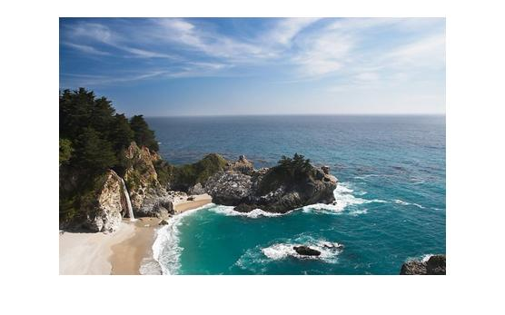
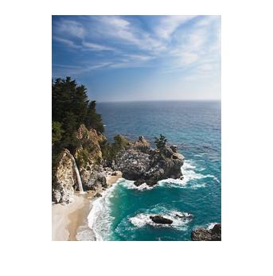
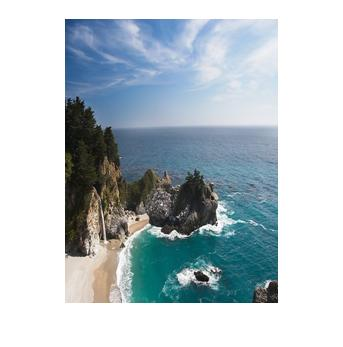
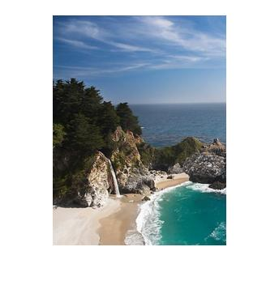
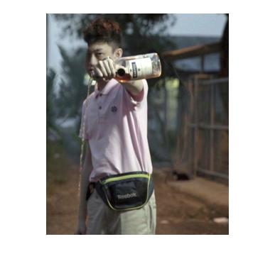
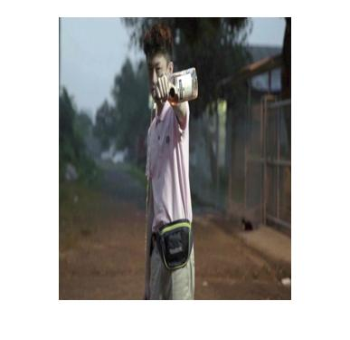
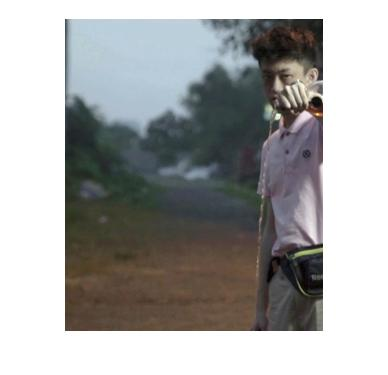
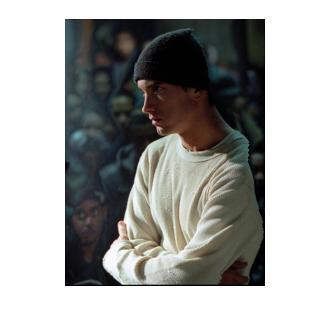
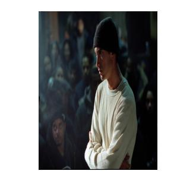
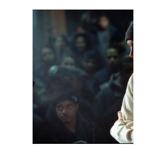

# Ching-Yao Chuang 102061145

# Project 3 / Seam Carving

## Overview
The project is related to seam carving and image resizing.

> Seam Carving for Content-Aware Image Resizing
, S. Avidan & A. Shamir


## Implementation
We simply follow TA's slides to implement.    

**1. Energy**        
In ```energyRGB.m```, we define a function that could map a pixel into energy value by calculating ```e=|dI/dx|+|dI/dy|```. Here's the code for single channel (grey scale) image.

```matlab
function res = energyGrey(I)
res = abs(imfilter(I, [-1,0,1])) + abs(imfilter(I, [-1,0,1]'));
end 
```
If the picture has 3 channels, just sum values of the energy for each channel.
```matlab
function res = energyRGB(I)
res = energyGrey(I(:, :, 1)) + energyGrey(I(:, :, 2)) + energyGrey(I(:, :, 3));
end
```

**2. Seam**    
Here we follow the paper by Avidan and Shamir to finds optimal seam by the given energy of an image. We would like to find ```M```, which represents minimum energy for all possible seams. This part is quite simple, using Matlab function min can nail it without effort.

```matlab
for i = 2:sz(1)
    for j = 2:sz(2)-1
        M(i,j) = M(i,j) + min([M(i-1,j-1),M(i-1,j),M(i-1,j+1)]);
    end
end
```

Next, we will traverse back the path of seam with minimum energy and update optimal seam mask.

```matlab
idx = idx-1;
optSeamMask(sz(1),idx) = 1;
for h = sz(1):-1:2
    [m,i] = min([M(h-1,idx-1),M(h-1,idx),M(h-1,idx+1)]);
    optSeamMask(h-1,idx+i-3) = 1;
    idx = idx+i-2;
end
```

**3. Image Resizing**   
The last thing to do is to removes pixels by the input mask we acquire from previous part. Ther are two version of function, vertical mask and the horizontal one. Here we only show the vertical one since they are quite similar.


```matlab
sz = size(image);
imageReduced = zeros(sz(1),sz(2)-1,sz(3));
for c = 1:sz(3)
    for h = 1:sz(1)
        [a,b] = min(seamMask(h,:));
        imageReduced(h,:,c) = [image(h,1:b-1,c), image(h,b+1:end,c)];
    end
end
```

## Installation
* Simply run ```seamCarvingTester.m``` with Matlab.

### Results

<table border=1>

<tr>
<td align="center">
<b>original</b>
</td>
<td align="center">
<b>seam carving<b/>
</td>
<td align="center">
<b>scaling<b/>
</td>
<td align="center">
<b>cropping<b/>
</td>
</tr>

<tr>
<td>

</td>
<td>

</td>
<td>

</td>
<td>

</td>
</tr>

<tr>
<td>

</td>
<td>

</td>
<td>

</td>
<td>

</td>
</tr>

<tr>
<td>

</td>
<td>

</td>
<td>

</td>
<td>

</td>
</tr>

</table>

